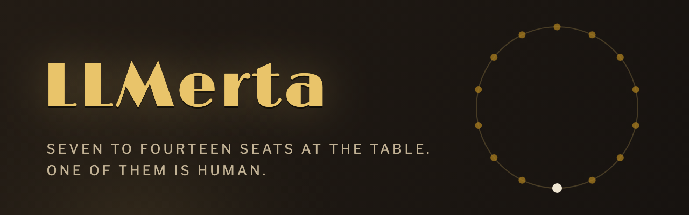

<p align="center">
  
</p>

<p align="center">
  <a href="https://github.com/linux4life1/LLMerta/releases/latest"></a>
  <a href="https://github.com/linux4life1/LLMerta/actions/workflows/ci.yaml"></a>
  <a href="LICENSE"></a>
  
  <a href="https://github.com/linux4life1/LLMerta/releases"></a>
</p>

**LLMerta** (*LLM* + *omertà*, the code of silence) is the social-deduction
game **Mafia** as a single-player desktop app — every seat except yours is an
LLM agent with its own model, persona, memory, and voice. Mafia normally
needs eight-plus humans in a room. Here you get a full table any night you
want one, and nobody has to drive anyone home afterward.

You talk, accuse, defend, and vote like everyone else at the table. The other
6–13 players deliberate privately, hold grudges across games, and lie to your
face with complete conviction. At dawn someone is gone, and the town starts
asking who did it. Maybe it was you.

## Why it's interesting

- **Every seat is its own mind.** Each AI player runs an isolated session —
  its own model choice, temperature, persona card, and private RAG-backed
  memory, so a 14-seat game stays coherent past any single context window.
- **Nothing leaks.** The engine's visibility model is enforced in code and in
  CI: agents and your screen only ever see events they're entitled to. No
  agent knows the mafia roster unless it's on it — and neither do you.
- **Mixed tables.** Seat 2 on a local GLM via oMLX, seat 3 on Grok through
  OpenRouter, seat 4 on whatever koboldcpp has loaded. Any OpenAI-compatible
  server works, plus Anthropic and Gemini directly.
- **The reveal.** When the game ends you get the full record: true roles, the
  private mafia chat, every agent's hidden reasoning behind every vote, and
  token usage per seat. The best part of losing is reading exactly how they
  played you.
- **Grudge memory.** Personas remember finished games. Betray the doctor
  tonight and she may open the next game with your name in her mouth.
- **Offline voices.** Optional TTS with 53 distinct speakers (Kokoro) or a
  lightweight single voice (Piper) — downloaded once, fully local.
- **Replays and resume.** Every game is a deterministic event log: quit
  mid-day and continue later, or step through a finished game move by move.

## Install

Grab the [latest release](https://github.com/linux4life1/LLMerta/releases/latest):

| Platform | Asset | Notes |
|---|---|---|
| **macOS** | `LLMerta.dmg` | Signed & notarized. Drag to Applications. |
| **Windows** | `LLMerta_Setup.exe` | Per-user install, no admin needed; bundles the VC++ runtime. |
| **Linux** | `LLMerta.AppImage` | `chmod +x` and run (`LLMerta_Linux.tar.gz` for the portable bundle). |

After the first install the app **updates itself**: it checks GitHub
releases on launch (toggleable in Settings → Updates), downloads in the
background, and swaps itself in on restart.

## Two minutes to a full table

1. **Connect a model source.** Settings → Connections scans your machine for
   running local servers — oMLX, koboldcpp, Ollama, LM Studio, llama.cpp —
   and adds one with a single click, no URLs to type. Hosted providers
   (OpenRouter, nano-GPT, Anthropic, Gemini) just need an API key; the URL
   is already set.
2. **New Game.** Pick seats (7–14), difficulty, and a scene. Cast the whole
   table with one connection and model, or fine-tune every seat — the model
   picker is searchable, so 300 OpenRouter models are a keystroke away, not
   a scroll.
3. **Deal the cards.** You get a role. So does everyone else. Good luck.

Roles in play: the **mafia** team, a **doctor**, a **sheriff**, a one-bullet
**assassin**, and the honest majority. House rules (night-zero peeks, tie
handling, discussion rounds, role mix) are all yours to bend.

Playing koboldcpp on limited VRAM? Run it with
`--admin --admindir <configs> --routermode` and LLMerta can cast different
models per seat — the server swaps them per request on its own. Plain
single-model servers simply offer their one model, so a table can't be
misconfigured.

## Local-first, by design

- **Connect-only.** LLMerta never launches, installs, or manages an LLM
  backend, and never downloads model weights. Your servers, your models,
  your keys.
- API keys live in the **OS keychain** (Keychain / Credential Manager /
  libsecret) — never in the database, never in saves or logs.
- **No telemetry.** The only network traffic is the model calls you
  configured, the update check, and voice downloads you click yourself.
- Sister project to [Front Porch AI](https://github.com/linux4life1/front-porch-AI):
  with FPA installed, LLMerta imports its character cards as table personas
  and its backgrounds as scenes — and you can sit at the table **as one of
  your own FPA personas**, avatar and all.

## Under the hood

A Flutter desktop shell over pure-Dart packages
(`game_core` · `llm` · `memory` · `tts` · `persistence`), a deterministic
event-sourced engine with seeded RNG, and a CI gate that keeps ≥90% line
coverage, golden screens, LLM-output fuzzing, and a spoiler-leak check green
on every commit.

| Doc | What's in it |
|---|---|
| [GAME_DESIGN.md](docs/GAME_DESIGN.md) | Rules, roles, 7–14 seat distributions, day/night flow, visibility model |
| [ARCHITECTURE.md](docs/ARCHITECTURE.md) | Stack, module layout, engine, persistence, packaging & updater |
| [LLM_INTEGRATION.md](docs/LLM_INTEGRATION.md) | Provider abstraction, agent sessions, structured decisions, RAG, TTS |
| [UI_UX.md](docs/UI_UX.md) | Screens, game-table layout, spoiler prevention, accessibility |
| [BALANCE.md](docs/BALANCE.md) | Live-model benchmark baseline and tuning levers |

### Building from source

```bash
git clone https://github.com/linux4life1/LLMerta.git
cd LLMerta/app
flutter pub get
flutter run -d macos   # or -d windows / -d linux
```

`./tool/test_all.sh` (from the repo root) runs the full gate: every package
suite, app tests with coverage, format and analyzer checks.

## License

[GNU AGPL-3.0](LICENSE) — like Front Porch AI. Play it, read it, fork it,
contribute; if you ship a modified version, share it back the same way.
